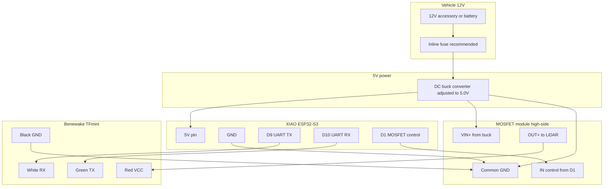

# GooseEye wiring diagram

## Block diagram



## Connection table

| From | To | Wire color / label |
|------|-----|-------------------|
| Vehicle 12 V+ (fused) | Buck `IN+` / `VIN+` | Red (main harness) |
| Vehicle 12 V− / chassis | Buck `IN−` / `GND` | Black |
| Buck 5 V output + | XIAO `5V` | |
| Buck 5 V output + | MOSFET `VIN+` / `DC+` | High-side input |
| Buck GND | XIAO `GND` | |
| Buck GND | MOSFET `GND` / `DC−` | |
| Buck GND | LiDAR black (GND) | Shared ground |
| MOSFET `OUT+` / switched + | LiDAR red (VCC) | **Do not** wire LiDAR VCC directly to buck |
| XIAO D9 (GPIO8) | LiDAR white (RX) | ESP TX → sensor RX |
| XIAO D10 (GPIO9) | LiDAR green (TX) | Sensor TX → ESP RX |
| XIAO D1 (GPIO2) | MOSFET `IN` / `PWM` / `CTRL` | Active-high = sensor on |

## TFmini cable colors

| Color | Function |
|-------|----------|
| Red | VCC (4.5–6 V) — through MOSFET |
| Black | GND |
| White | UART RX (into sensor) |
| Green | UART TX (out of sensor) |

## MOSFET module labels

Amazon and clone boards use different silkscreen text. Match function, not exact words:

| Common label | Role |
|--------------|------|
| `VIN+`, `DC+`, `IN+` | 5 V in from buck |
| `OUT+`, `LOAD+` | Switched 5 V to LiDAR red |
| `GND`, `DC−`, `VIN−` | Common with buck and XIAO |
| `IN`, `PWM`, `SIG`, `CTRL` | Control from XIAO D1 |

**Verify your board** with a multimeter before powering the LiDAR. Add a photo of your module to `docs/images/` when you have one.

## ASCII sketch (signal + power)

```
  12V ----[FUSE]----> BUCK IN+
  GND ---------------> BUCK IN-

  BUCK 5V+ -----+----> XIAO 5V
                 |
                 +----> MOSFET VIN+
  BUCK GND ------+----> XIAO GND
                 +----> MOSFET GND
                 +----> LiDAR BLACK

  MOSFET OUT+ -----------> LiDAR RED

  XIAO D9  --------------> LiDAR WHITE
  XIAO D10 <-------------- LiDAR GREEN
  XIAO D1  --------------> MOSFET IN
```

## Important notes

- **Never apply 12 V to the XIAO or LiDAR.** Only 5 V regulated.
- UART lines stay connected while the LiDAR is unpowered; firmware cuts VCC via the MOSFET in sleep mode.
- If LiDAR never powers on but UART works, check D1 wiring and whether your module is active-low (see troubleshooting in [ASSEMBLY.md](ASSEMBLY.md)).
